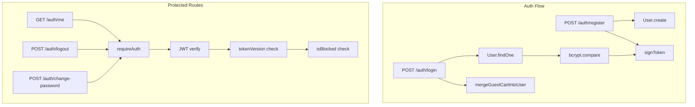

# تقييم نظام التسجيل وتسجيل الدخول (Auth System)

## 1. نظرة عامة على البنية



**الملفات الرئيسية:**
- [src/routes/auth.routes.js](src/routes/auth.routes.js) - مسارات التسجيل والدخول
- [src/middleware/auth.js](src/middleware/auth.js) - requireAuth, requireRole, requirePermission
- [src/utils/jwt.js](src/utils/jwt.js) - إصدار وتحقق JWT
- [src/models/User.js](src/models/User.js) - نموذج المستخدم

---

## 2. ما يعمل بشكل صحيح (احترافي)

| الجانب | التفاصيل |
|--------|----------|
| **تجزئة كلمات المرور** | bcrypt مع عدد جولات قابل للتكوين (BCRYPT_ROUNDS، افتراضي 10) |
| **قوة كلمة المرور** | 8-128 حرف، حرف واحد ورقم واحد على الأقل (Zod) |
| **منع تعداد الحسابات** | التسجيل يعيد استجابة "نجاح" حتى لو الإيميل موجود (requiresLogin + token: null) |
| **تأخير زمني (Register)** | REGISTER_MIN_DELAY_MS لمواجهة هجمات التوقيت والتشبع |
| **JWT آمن** | خوارزمية HS256، issuer، audience، تحقق إجباري |
| **سر JWT** | التحقق من طول JWT_SECRET >= 16 |
| **إبطال التوكن** | tokenVersion يُحدَّث عند logout/تغيير كلمة المرور |
| **حظر المستخدمين** | isBlocked يمنع الدخول ويُرجع USER_BLOCKED |
| **RBAC** | أدوار user/admin/staff مع صلاحيات لـ staff |
| **Rate limiting** | limitAuth (12 طلب/دقيقة) على مسارات /auth |
| **حماية البيانات الحساسة** | select بدون passwordHash في /me |
| **دمج السلة** | دمج سلة الزائر عند تسجيل الدخول عبر guestCartId |

---

## 3. مسارات المصادقة

| المسار | الطريقة | Auth | الوصف |
|--------|---------|------|-------|
| /auth/register | POST | لا | تسجيل مستخدم جديد |
| /auth/login | POST | لا | تسجيل الدخول |
| /auth/me | GET | JWT | بيانات المستخدم الحالي |
| /auth/change-password | POST | JWT | تغيير كلمة المرور |
| /auth/logout | POST | JWT | تسجيل الخروج (إبطال التوكن) |
| /auth/refresh | POST | لا | تجديد access token باستخدام refresh token |

---

## 4. مشكلات محتملة وتوصيات

### 4.1 عدم إرجاع Refresh Token عند تسجيل الدخول

- **الحالة:** `/auth/login` و `/auth/register` يعيدان access token فقط، ولا يعيدان refresh token.
- **التأثير:** مسار `/auth/refresh` غير قابل للاستخدام بشكل كامل لأن العميل لا يحصل على refresh token أساسي.
- **المعيار:** في أنظمة refresh token، يُفترض أن يعيد login/register access token وrefresh token.
- **التوصية:** إرجاع refresh token في استجابة login و register إذا كان المطلوب دعم دورة refresh كاملة.

### 4.2 هجوم التوقيت (Timing Attack) عند تسجيل الدخول

- **الحالة:** عند محاولة تسجيل دخول بـإيميل غير موجود، الاستجابة أسرع من حالة "إيميل صحيح وكلمة مرور خاطئة" لأن bcrypt.compare لا يُنفَّذ.
- **التأثير:** يمكن استنتاج وجود إيميل في النظام من خلال قياس زمن الاستجابة.
- **التوصية:** تشغيل bcrypt.hash على كلمة مرور وهمية عند عدم وجود المستخدم لتقريب زمن الاستجابة (مع الحفاظ على رسالة "Invalid credentials").

### 4.3 Rate Limit موحّد لجميع مسارات Auth

- **الحالة:** limitAuth (12 طلب/دقيقة) يغطي register و login و refresh و change-password و logout و me.
- **التأثير:** عدد كبير من محاولات login قد يمنع تسجيل مستخدمين جدد أو استخدام /me.
- **التوصية:** فصل limiters:
  - limitLogin: حدود أشد لـ login (مثلاً 6/دقيقة)
  - limitRegister: حدود أخف (مثلاً 5/دقيقة)
  - limitAuthGeneral: لـ refresh, me, change-password

### 4.4 عدم وجود قفل الحساب (Account Lockout)

- **الحالة:** لا يوجد قفل مؤقت للحساب بعد عدد معين من محاولات فاشلة.
- **التوصية:** إضافة آلية lockout بعد N محاولات فاشلة (مثلاً 5) لفترة محددة (مثلاً 15 دقيقة)، مع تخزين المحاولات في Redis أو MongoDB.

### 4.5 عدم التحقق من البريد الإلكتروني

- **الحالة:** لا يوجد تأكيد للبريد الإلكتروني قبل تمكين الحساب.
- **التأثير:** إمكانية إنشاء حسابات بإيميلات مزيفة.
- **التوصية:** إضافة تأكيد البريد (isEmailVerified + رابط تأكيد) إذا كان مطلوباً للمشروع.

### 4.6 عدم وجود استعادة كلمة المرور

- **الحالة:** لا يوجد مسار "نسيت كلمة المرور" أو reset password.
- **التوصية:** إضافة:
  - POST /auth/forgot-password (يرسل رابط إعادة التعيين)
  - POST /auth/reset-password (token + كلمة مرور جديدة)

### 4.7 استجابة Register عند وجود الإيميل

- **الحالة:** عند وجود الإيميل مسبقاً يُعاد `{ ok: true, token: null, user: null, requiresLogin: true }`.
- **ملاحظة:** الفرونت إند يجب أن يتحقق من requiresLogin ويوجّه للتسجيل بدلاً من افتراض فشل العملية.
- **توثيق:** التأكد من وثائق API توضّح هذا السلوك للفرونت إند.

---

## 5. مقارنة مع ممارسات المواقع العالمية

| المعيار | الحالة | ملاحظات |
|---------|--------|---------|
| تجزئة كلمات المرور | ممتاز | bcrypt |
| قوة كلمة المرور | جيد | 8+ أحرف، حرف ورقم |
| منع تعداد الحسابات | ممتاز | استجابة موحدة عند التسجيل |
| JWT + إبطال | ممتاز | tokenVersion |
| RBAC | ممتاز | roles + permissions |
| Rate limiting | جيد | 12/min على /auth |
| Refresh token | جزئي | المسار موجود لكن login لا يعيده |
| Lockout | غير موجود | تحسين مقترح |
| تأكيد البريد | غير موجود | تحسين مقترح |
| استعادة كلمة المرور | غير موجود | تحسين مقترح |
| Timing attack mitigation | جزئي | تأخير في register فقط |

---

## 6. هيكل الاستجابات والأخطاء

### تسجيل ناجح (مستخدم جديد)
```json
{
  "ok": true,
  "success": true,
  "data": {
    "token": "eyJ...",
    "user": { "id": "...", "name": "...", "email": "...", "role": "user" }
  }
}
```

### تسجيل – إيميل موجود
```json
{
  "ok": true,
  "success": true,
  "data": {
    "token": null,
    "user": null,
    "requiresLogin": true
  }
}
```

### تسجيل الدخول ناجح
```json
{
  "ok": true,
  "success": true,
  "data": {
    "token": "eyJ...",
    "user": { "id": "...", "name": "...", "email": "...", "role": "user" },
    "cartMerged": 2
  }
}
```

### أخطاء مصادقة
| الكود | HTTP | الوصف |
|-------|------|--------|
| INVALID_CREDENTIALS | 401 | بريد أو كلمة مرور غير صحيحة |
| USER_BLOCKED | 403 | الحساب محظور |
| UNAUTHORIZED | 401 | توكن مفقود أو غير صالح أو منتهٍ |
| AUTH_RATE_LIMITED | 429 | تجاوز حد الطلبات |
| VALIDATION_ERROR | 400 | فشل التحقق من المدخلات (Zod) |

---

## 7. التحسينات المُنفّذة

- **Refresh token:** يُرجَع في login و register (حقل `refreshToken` و `expiresIn`).
- **هجوم التوقيت:** تشغيل bcrypt.hash عند عدم وجود المستخدم لتقريب زمن الاستجابة.
- **Rate limiters منفصلة:** limitLogin (6/دقيقة)، limitRegister (5/دقيقة)، limitAuthGeneral (30/دقيقة)، limitForgotPassword (3/15 دقيقة).
- **استعادة كلمة المرور:** POST /auth/forgot-password و POST /auth/reset-password مع نموذج PasswordResetToken.
- **قفل الحساب:** بعد LOGIN_MAX_ATTEMPTS (افتراضي 5) محاولات فاشلة، قفل لمدة LOGIN_LOCKOUT_MINUTES (افتراضي 15) دقيقة، استجابة 423 ACCOUNT_LOCKED.
- **التحقق من البريد:** isEmailVerified في User، POST /auth/verify-email، POST /auth/send-verification-email (يتطلب تسجيل دخول).

---

## 8. الخلاصة

النظام الحالي يغطي الأساسيات بشكل جيد: تجزئة آمنة لكلمات المرور، JWT مع إبطال، RBAC، منع تعداد الحسابات، وحماية من المستخدمين المحظورين. أهم نقاط التحسين: إكمال دورة refresh token، والتخفيف من هجمات التوقيت، وفصل حدود الطلبات لمسارات المصادقة.
