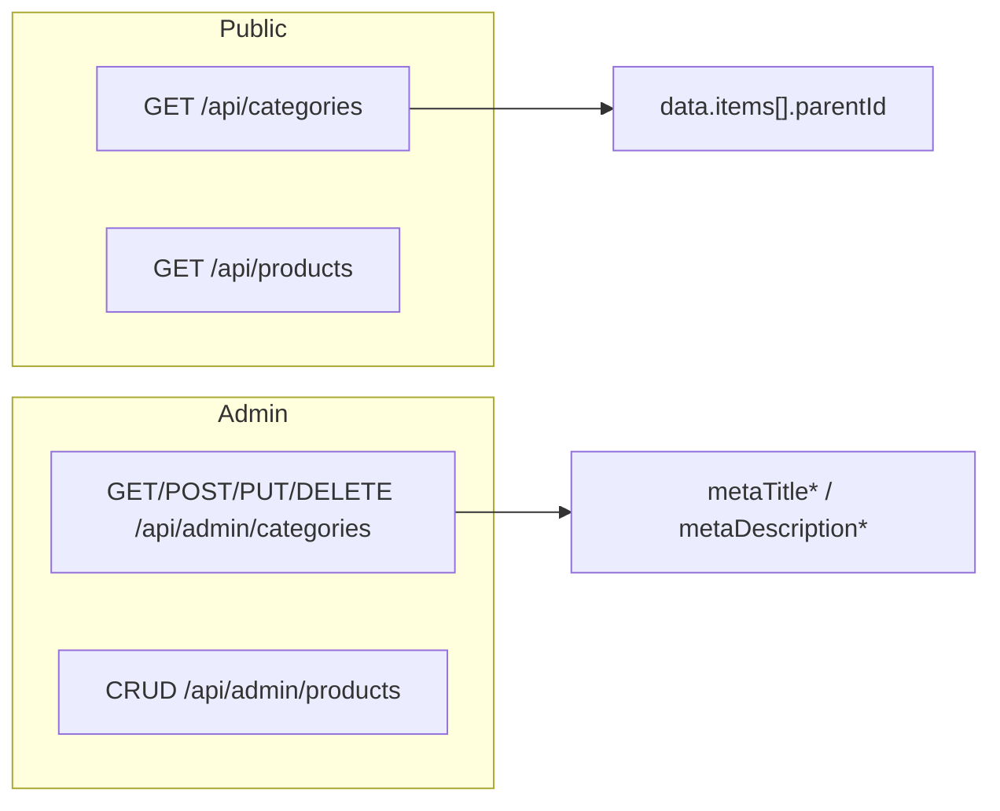

# تقرير توافق الفرونت إند مع السيرفر

## الهدف من التقرير

بعد التعديلات على السيرفر (نظام المنتجات والفئات)، هذا التقرير يوضح ما يجب على الفرونت إند تغييره أو مراعاته ليكون متوافقاً 100% مع الـ API الحالي.

---

## 1. الفئات (Categories)

### 1.1 قائمة الفئات العامة (للزوار والمتجر)

- **المسار:** `GET /api/categories` أو `GET /api/v1/categories`
- **التغيير:** الاستجابة تحتوي الآن على حقل **`parentId`** لكل فئة.

**شكل الاستجابة الحالي:**

```json
{
  "ok": true,
  "success": true,
  "data": {
    "items": [
      {
        "_id": "...",
        "nameHe": "...",
        "nameAr": "...",
        "name": "...",
        "slug": "...",
        "imageUrl": "...",
        "parentId": "ObjectId | null"
      }
    ]
  },
  "meta": { "total": 5 }
}
```

**إجراء الفرونت إند:**

- قراءة `parentId` من كل عنصر في `data.items`.
- إذا أردتم عرض شجرة فئات (هيراركية): بناء الشجرة في الواجهة باستخدام `parentId` (العناصر التي `parentId === null` هي الجذور، والباقي يُربط حسب `parentId`).
- لا تغيير مطلوب إذا كنتم تعرضون قائمة مسطحة فقط؛ يمكنكم تجاهل `parentId` أو استخدامه لاحقاً.

### 1.2 إنشاء / تعديل / حذف الفئات (أدمن فقط)

- **التغيير:** تم إلغاء إنشاء وتعديل وحذف الفئات من المسار العام.
- **المسارات القديمة (لم تعد تعمل):**
  - `POST /api/categories` — لا يوجد
  - `PUT /api/categories/:id` — لا يوجد
  - `DELETE /api/categories/:id` — لا يوجد

- **المسارات الصحيحة (يجب استخدامها):**
  - قائمة: `GET /api/admin/categories` أو `GET /api/v1/admin/categories`
  - إنشاء: `POST /api/admin/categories` أو `POST /api/v1/admin/categories`
  - قراءة واحدة: `GET /api/admin/categories/:id`
  - تعديل: `PUT /api/admin/categories/:id`
  - حذف: `DELETE /api/admin/categories/:id`

**إجراء الفرونت إند:**

- أي شاشة أو خدمة تقوم بإنشاء/تعديل/حذف فئات يجب أن تستدعي **فقط** مسارات الأدمن أعلاه (مع توكن الأدمن في الـ header).
- التأكد من أن الـ base URL للفئات في لوحة الأدمن يشير إلى `/api/admin/categories` (أو `/api/v1/admin/categories`).

### 1.3 حقول SEO للفئات (أدمن)

- **التغيير:** السيرفر يحفظ الآن حقول SEO تحت أسماء الحقول في قاعدة البيانات.
- **الحقول المقبولة في الطلب (كلها اختيارية):**

| اسم الحقل في الطلب | الطول الأقصى | ملاحظة |
|-------------------|---------------|--------|
| `metaTitleHe`     | 70            | مفضّل |
| `metaTitleAr`     | 70            | مفضّل |
| `metaDescriptionHe` | 160        | مفضّل |
| `metaDescriptionAr` | 160        | مفضّل |
| `seoTitleHe`      | 70            | بديل لـ metaTitleHe (للتوافق مع قديم) |
| `seoTitleAr`      | 70            | بديل لـ metaTitleAr |
| `seoDescHe`       | 160           | بديل لـ metaDescriptionHe |
| `seoDescAr`       | 160           | بديل لـ metaDescriptionAr |

- **في الاستجابة (GET واحد أو قائمة):** السيرفر يعيد الفئة كاملة؛ حقول الـ SEO المخزنة هي `metaTitleHe`, `metaTitleAr`, `metaDescriptionHe`, `metaDescriptionAr`. إذا كنتم تقرؤونها للعرض أو التعديل، استخدموا هذه الأسماء.

**إجراء الفرونت إند:**

- في نماذج إنشاء/تعديل الفئة في الأدمن: إما إرسال `metaTitleHe`, `metaTitleAr`, `metaDescriptionHe`, `metaDescriptionAr`، أو الإبقاء على إرسال `seoTitleHe`, `seoTitleAr`, `seoDescHe`, `seoDescAr` (كلاهما يعمل).
- عند قراءة الفئة للتعديل: الاعتماد على الحقول `metaTitleHe`, `metaTitleAr`, `metaDescriptionHe`, `metaDescriptionAr` في الاستجابة.

---

## 2. المنتجات (Products)

### 2.1 البحث النصي وقائمة المنتجات

- **المسار:** `GET /api/products` أو `GET /api/v1/products`
- **التغيير (داخلي في السيرفر):** عند إرسال `q` (بحث نصي)، السيرفر يرتب النتائج حسب **الأكثر صلة** ثم `createdAt`. لا تغيير في شكل الاستجابة.

**إجراء الفرونت إند:**

- لا تغيير مطلوب في الـ request أو الـ response.
- إذا كنتم تعرضون "نتائج البحث"، الترتيب الحالي من السيرفر يعكس الصلة (relevance) ثم الأحدث.

### 2.2 المخزون وسياسة التوفر (trackInventory / allowBackorder)

- **التغيير:** السيرفر يطبق الآن منطق:
  - **trackInventory = false:** المنتج لا يُخصم منه مخزون ويُعتبر متاحاً دائماً للطلب.
  - **allowBackorder = true:** يُسمح بالطلب حتى لو الكمية المطلوبة أكبر من المخزون (وقد يصبح المخزون سالباً).

**شكل الـ API:** لم يتغير؛ نفس طلبات الحجز والدفع ونفس الاستجابات.

**إجراء الفرونت إند (اختياري لتحسين التجربة):**

- إذا كان المنتج يعيد حقلين مثل `trackInventory` و `allowBackorder` (من تفاصيل المنتج أو من الأدمن):
  - عند `allowBackorder === true`: إظهار رسالة من نوع "متاح للطلب (حتى في حال نفاد المخزون)" أو "يمكن الطلب كطلب مسبق".
  - عند `trackInventory === false`: عدم الاعتماد على "الكمية المتوفرة" للعرض إن لم تكن ذات معنى (مثلاً عرض "متوفر" بدون رقم).
- لا حاجة لتغيير مسارات أو حقول الطلب/الاستجابة إذا كنتم لا يعرضون هذه الحالات بشكل خاص.

---

## 3. ملخص الإجراءات المطلوبة من الفرونت إند

| البند | الإجراء | أولوية |
|-------|---------|--------|
| قائمة الفئات العامة | دعم الحقل الجديد `parentId` في `data.items` وبناء الشجرة إن لزم | مطلوب إذا كانت الشجرة مستخدمة |
| إنشاء/تعديل/حذف الفئات | استخدام مسارات الأدمن فقط (`/api/admin/categories` أو `/api/v1/admin/categories`) وعدم استخدام `POST/PUT/DELETE` على `/api/categories` | **مطلوب** |
| حقول SEO للفئات (أدمن) | إرسال إما `metaTitle*`/`metaDescription*` أو `seo*`؛ وقراءة `metaTitle*`/`metaDescription*` من الاستجابة | موصى به للاتساق |
| بحث المنتجات | لا تغيير؛ الترتيب حسب الصلة عند وجود `q` | لا إجراء |
| المخزون و backorder | استخدام `trackInventory` و `allowBackorder` في الواجهة إن وُجدت لتحسين العرض فقط | اختياري |

---

## 4. مسارات الـ API المرجعية (بعد التعديلات)



- **عام (بدون auth):**
  - `GET /api/categories`, `GET /api/v1/categories` — قائمة فئات (مع `parentId`).
  - `GET /api/products`, `GET /api/v1/products` — قائمة منتجات (مع بحث وترتيب حسب الصلة عند `q`).

- **أدمن (مع توكن):**
  - كل عمليات الفئات على: `GET/POST/PUT/DELETE /api/admin/categories` (أو `/api/v1/admin/categories`).
  - عمليات المنتجات كما هي على مسارات الأدمن الخاصة بالمنتجات.

---

هذا الملف مرجع للفرونت إند؛ يمكن مشاركته مع الفريق لتنفيذ التعديلات أعلاه والوصول إلى توافق 100% مع السيرفر.
